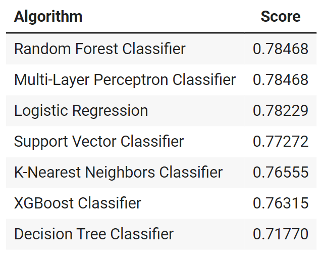

# Titanic Survivor Prediction

This is a baby step for Machine Learning Competitions on [Kaggle](https://www.kaggle.com/c/titanic/overview). 

## The Challenge

The Titanic sank during her maiden voyage in 1912, causing more than half of their passengers' life.

Two datasets are given, the train.csv and test.csv. Both datasets contain the information of each passenger who boarded the Titanic ship, with the only difference is that train.csv tells us which passenger survives while test.csv does not. The challenge is to build a predictive model to predict which of those passengers in test.csv are more likely to survive.

## Predictive Models

For this challenge, several classification models are used to predict the survival of the passengers. Score is the categorization accuracy evaluated by Kaggle, with 1 being the perfect score. Below shows a list of algorithms that are used with score sorted.

The Random Forest Classifier and the MLP Classifier that are build have the highest score.

## Future Extension

Future extend of this work includes fine-tuning the predictive model in terms of data cleaning and a better feature selection. 

